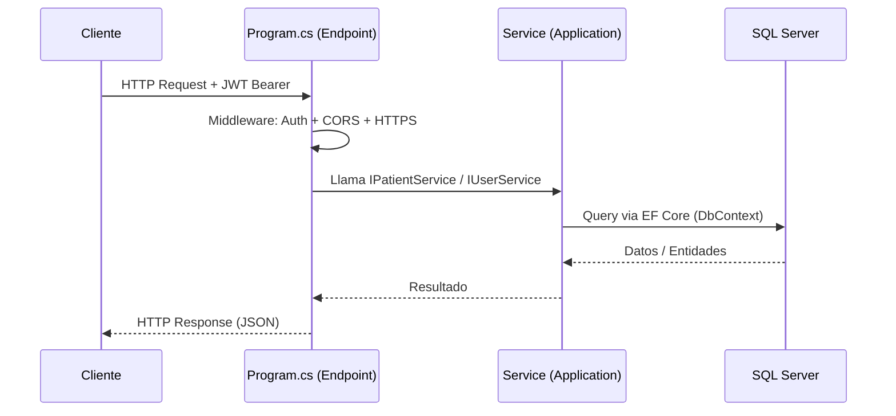
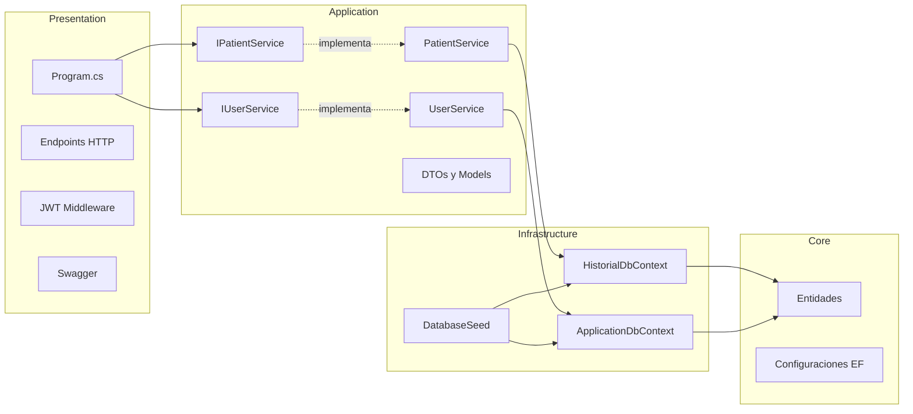

# 🏥 Sistema de Historial Médico — Documentación Técnica

> **HistorialMedico API** es un backend REST desarrollado en **.NET (C#)** con **ASP.NET Core Minimal APIs**, **Entity Framework Core** y **ASP.NET Core Identity**. Su propósito es gestionar de forma segura pacientes pediátricos, sus expedientes clínicos, historial de notas médicas y archivos adjuntos, bajo un sistema de autenticación basado en JWT con roles diferenciados.

---

## 📋 Tabla de Contenidos

1. [Descripción General y Casos de Uso](#1-descripción-general-y-casos-de-uso)
2. [Stack Tecnológico](#2-stack-tecnológico)
3. [Arquitectura del Sistema](#3-arquitectura-del-sistema)
4. [Modelo de Datos (Entidades)](#4-modelo-de-datos-entidades)
5. [Base de Datos — Esquema ER](#5-base-de-datos--esquema-er)
6. [Capa de Infraestructura](#6-capa-de-infraestructura)
7. [Capa de Aplicación — Deep Dive de Servicios](#7-capa-de-aplicación--deep-dive-de-servicios)
8. [Capa de Presentación — Endpoints REST](#8-capa-de-presentación--endpoints-rest)
9. [Autenticación JWT — Flujo Completo](#9-autenticación-jwt--flujo-completo)
10. [DTOs y Modelos de Entrada](#10-dtos-y-modelos-de-entrada)
11. [Configuración y Arranque](#11-configuración-y-arranque)
12. [Usuarios y Roles por Defecto (Database Seed)](#12-usuarios-y-roles-por-defecto-database-seed)

---

## 1. Descripción General y Casos de Uso

El sistema está diseñado para consultorios médicos (especialmente pediatría) que necesitan digitalizar y centralizar la gestión de pacientes. Permite llevar un expediente clínico completo de cada paciente, registrar notas médicas cronológicas y adjuntar documentos (resultados de laboratorio, imágenes, informes) directamente al perfil del paciente.

### 🏥 Casos de Uso Principales

| Actor | Caso de Uso | Descripción |
|-------|------------|-------------|
| **Administrador** | Gestionar usuarios | Crear, editar y eliminar cuentas de doctores/usuarios del sistema |
| **Administrador** | Ver todos los usuarios | Listar el equipo médico con sus roles asignados |
| **Doctor / Usuario** | Registrar paciente | Crear el expediente completo de un nuevo paciente |
| **Doctor / Usuario** | Buscar paciente | Obtener expediente por ID, con historial y adjuntos incluidos |
| **Doctor / Usuario** | Actualizar datos | Modificar información demográfica o clínica del paciente |
| **Doctor / Usuario** | Agregar nota clínica | Añadir una entrada al historial médico del paciente con fecha automática |
| **Doctor / Usuario** | Subir documentos | Adjuntar PDFs, imágenes o documentos Word al expediente |
| **Doctor / Usuario** | Descargar documentos | Recuperar cualquier archivo adjunto para su visualización |
| **Sistema** | Numerar expedientes | Generar automáticamente números únicos con formato `YYYY-N` |
| **Sistema** | Autenticar usuarios | Emitir tokens JWT para acceso seguro a la API |

### 🔄 Flujo de Trabajo Típico

```
1. Doctor inicia sesión  →  Obtiene JWT token
2. Busca/crea paciente  →  Expediente asignado automáticamente
3. Agrega notas clínicas de la consulta
4. Adjunta resultados de laboratorio o imágenes
5. Consulta historial en próximas visitas
```

---

## 2. Stack Tecnológico

| Componente | Tecnología |
|-----------|-----------|
| **Runtime** | .NET (ASP.NET Core) |
| **Patrón API** | Minimal APIs (sin controllers) |
| **ORM** | Entity Framework Core |
| **Base de Datos** | Microsoft SQL Server |
| **Identidad / Auth** | ASP.NET Core Identity + JWT Bearer |
| **Tokens** | JSON Web Tokens (HMAC SHA-256) |
| **Documentación API** | Swagger / OpenAPI |
| **Arquitectura** | Clean Architecture (4 capas) |
| **Inyección de Dependencias** | Built-in .NET DI Container |

---

## 3. Arquitectura del Sistema

El proyecto aplica los principios de **Clean Architecture** (Arquitectura Limpia), donde la regla de oro es que las capas internas nunca conocen a las capas externas. La dependencia siempre apunta hacia el núcleo (Core).


### Estructura de Solución

```
HistorialMedico.sln
│
├── Core/                          ← Dominio puro, sin dependencias externas
│   ├── Entities/
│   │   ├── BaseEntity.cs          ← Id (GUID), CreatedAt, UpdatedAt
│   │   ├── Patient.cs             ← Entidad principal del paciente
│   │   ├── MedicalHistory.cs      ← Notas clínicas del paciente
│   │   ├── Attachment.cs          ← Archivos adjuntos del paciente
│   │   ├── ExpedienteCounter.cs   ← Contador anual de expedientes
│   │   ├── User.cs                ← Usuario extendido de Identity
│   │   ├── Role.cs                ← Rol extendido de Identity
│   │   └── Parent.cs              ← Entidad Padre/Tutor (disponible)
│   ├── Configurations/            ← Configuraciones de Fluent API (EF Core)
│   │   ├── BaseEntityConfiguration.cs
│   │   ├── PatientsConfiguration.cs
│   │   ├── MedicalHistoriesConfiguration.cs
│   │   ├── AttachmentsConfiguration.cs
│   │   └── ...
│   └── Enums/
│       └── Sexo.cs
│
├── Application/                   ← Lógica de negocio e interfaces
│   ├── PatientService/
│   │   ├── IPatientService.cs     ← Contrato del servicio de pacientes
│   │   ├── PatientService.cs      ← Implementación
│   │   ├── JwtSettings.cs         ← Config JWT + LoginResponse DTO
│   │   ├── PaginatedList.cs       ← Resultado paginado genérico
│   │   └── PaginationQuery.cs     ← Query params de paginación
│   └── UserService/
│       ├── IUserService.cs        ← Contrato del servicio de usuarios
│       ├── UserService.cs         ← Implementación con Identity
│       ├── LoginModel.cs          ← DTO de login
│       └── RegisterModel.cs       ← DTO de registro/actualización
│
├── Infrastructure/                ← Acceso a datos, persistencia
│   ├── Context/
│   │   ├── HistorialDbContext.cs  ← DbContext de pacientes/historial
│   │   └── ApplicationDbContext.cs ← DbContext de Identity (usuarios)
│   ├── Migrations/                ← Migraciones EF Core
│   └── DatabaseSeed.cs           ← Datos iniciales de prueba
│
└── Presentation/                  ← Punto de entrada, endpoints HTTP
    ├── Program.cs                 ← Bootstrap + todos los endpoints
    ├── appsettings.json
    ├── appsettings.Development.json
    └── wwwroot/                   ← Archivos estáticos + uploads
        └── patients/{id}/         ← Archivos adjuntos por paciente
```

### Flujo de una Petición HTTP



---

## 4. Modelo de Datos (Entidades)

### `BaseEntity` — Clase Base Compartida

Todas las entidades del dominio heredan de esta clase, garantizando campos estándar de auditoría.

```csharp
public class BaseEntity
{
    [Key]
    [DatabaseGenerated(DatabaseGeneratedOption.Identity)]
    public Guid Id { get; set; }       // Identificador único universal (UUID v4)
    public DateTime CreatedAt { get; set; }  // Timestamp de creación
    public DateTime UpdatedAt { get; set; }  // Timestamp de última modificación
}
```

---

### `Patient` — Expediente del Paciente

Entidad central del sistema. Almacena toda la información demográfica y clínica del paciente pediátrico.

```csharp
public class Patient : BaseEntity
{
    public string NumeroExpediente { get; set; }   // ← Auto-generado: "2026-1"
    [Required]
    public string Nombre { get; set; }             // Nombre completo
    public string Sexo { get; set; }               // "M" / "F"
    public string Edad { get; set; }               // Ej: "4 años"
    public string Diagnostico { get; set; }        // Diagnóstico principal
    public string ReferidoPor { get; set; }        // Médico que refiere
    public string FechaNacimiento { get; set; }    // ISO date string
    public string FechaConsulta { get; set; }      // ISO date string
    public string SeguroMedico { get; set; }       // Compañía de seguro
    public string Alergias { get; set; }           // Alergias conocidas

    // Datos de los padres/tutores
    public string Madre { get; set; }
    public string MadreTelefono { get; set; }      // [Phone] validado
    public string MadreCorreo { get; set; }        // [EmailAddress] validado
    public string Padre { get; set; }
    public string PadreTelefono { get; set; }
    public string PadreCorreo { get; set; }

    // Datos perinatales
    public string Gestacion { get; set; }          // Semanas de gestación
    public string Parto { get; set; }              // Tipo de parto
    public string PesoAlNacer { get; set; }        // Valor numérico
    public string PesoUnidad { get; set; }         // "kg" / "lb"

    // Relaciones (Navigation Properties)
    public List<MedicalHistory> Historial { get; set; }
    public List<Attachment> Attachments { get; set; }
}
```

**Restricciones configuradas (Fluent API):**
- `Nombre`: máximo 50 caracteres, requerido
- `NumeroExpediente`: requerido (único por diseño de negocio)
- `Historial` y `Attachments`: **Cascade Delete** — al eliminar el paciente, se eliminan todas sus notas y archivos

---

### `MedicalHistory` — Notas Clínicas

Registro cronológico de cada visita o nota médica. Relación muchos-a-uno con `Patient`.

```csharp
public class MedicalHistory : BaseEntity
{
    public string Nota { get; set; }        // Contenido de la nota clínica (texto libre)
    public DateTime Fecha { get; set; }     // Fecha/hora de la nota (asignada automáticamente)
    
    [ForeignKey("Patient")]
    public Guid PatientId { get; set; }     // FK → Patient.Id
    
    [JsonIgnore]                            // Evita ciclos de serialización
    public virtual Patient? Patient { get; set; }
}
```

---

### `Attachment` — Archivos Adjuntos

Almacena metadatos de archivos físicos guardados en el sistema de archivos del servidor.

```csharp
public class Attachment : BaseEntity
{
    public string Name { get; set; }        // Nombre original del archivo ("resultados.pdf")
    public string Path { get; set; }        // Ruta física en el servidor
    public DateTime UploadDate { get; set; }// UTC timestamp de carga
    public string Size { get; set; }        // Tamaño formateado: "1.23 MB"
    
    [ForeignKey("Patient")]
    public Guid PatientId { get; set; }
    
    [JsonIgnore]
    public virtual Patient? Patient { get; set; }
}
```

> **Nota:** El archivo físico se guarda en `wwwroot/patients/{patientId}/{UUID}.ext`. La base de datos solo guarda la ruta, nombre original y metadatos.

---

### `ExpedienteCounter` — Contador de Expedientes

Tabla auxiliar que mantiene el conteo anual de expedientes creados para generar números secuenciales únicos.

```csharp
public class ExpedienteCounter : BaseEntity
{
    public int Year { get; set; }      // Año fiscal: 2026
    public int Counter { get; set; }   // Secuencia actual: 42 → próximo será "2026-42"
}
```

---

### `User` — Usuario del Sistema

Extiende `IdentityUser` de ASP.NET Core Identity con campos de nombre completo.

```csharp
public class User : IdentityUser
{
    public string FirstName { get; set; }     // Primer nombre (requerido)
    public string? MiddleName { get; set; }   // Segundo nombre (opcional)
    public string LastName { get; set; }      // Primer apellido (requerido)
    public string? SecondLastName { get; set; }// Segundo apellido (opcional)
    
    // Propiedad computada — nunca almacenada en DB
    public string FullName =>
        $"{FirstName} {MiddleName} {LastName} {SecondLastName}"
            .Trim().Replace("  ", " ");
}
```

Hereda de `IdentityUser`: `Id`, `UserName`, `Email`, `PasswordHash`, `EmailConfirmed`, `SecurityStamp`, etc.

---

### `Role` — Roles del Sistema

Extiende `IdentityRole` con descripción y timestamp de creación.

```csharp
public class Role : IdentityRole
{
    public string? Description { get; set; }           // Descripción del rol
    public DateTime CreatedAt { get; set; } = DateTime.UtcNow;
}
```

Roles disponibles: **`Admin`** y **`User`**

---

## 5. Base de Datos — Esquema ER

El sistema utiliza **dos bases de datos SQL Server independientes**:

| Base de Datos | Contexto EF Core | Propósito |
|--------------|-----------------|-----------|
| `HistorialMedico` | `HistorialDbContext` | Pacientes, historiales y adjuntos |
| `AspnetUsers` | `ApplicationDbContext` | Usuarios, roles (ASP.NET Identity) |


### Relaciones Clave

```
Patient  ──(1)──────────(N)──  MedicalHistory
Patient  ──(1)──────────(N)──  Attachment
```

Ambas relaciones tienen `ON DELETE CASCADE`: eliminar un `Patient` elimina en cascada todo su historial y adjuntos.

---

## 6. Capa de Infraestructura

### `HistorialDbContext`

Contexto principal para los datos clínicos:

```csharp
public class HistorialDbContext : DbContext
{
    public DbSet<Patient> Patients { get; set; }
    public DbSet<ExpedienteCounter> ExpedienteCounters { get; set; }
    public DbSet<MedicalHistory> MedicalHistories { get; set; }
    public DbSet<Attachment> Attachments { get; set; }
}
```

### `ApplicationDbContext`

Contexto de identidad, hereda de `IdentityDbContext<User, Role, string>`:

```csharp
public class ApplicationDbContext : IdentityDbContext<User, Role, string>
{
    public DbSet<User> Users { get; set; }
    public DbSet<Role> Roles { get; set; }
}
```

Hereda automáticamente: `AspNetUsers`, `AspNetRoles`, `AspNetUserRoles`, `AspNetUserClaims`, `AspNetRoleClaims`, `AspNetUserTokens`, `AspNetUserLogins`.

### `DatabaseSeed` — Datos Iniciales

Al arrancar la aplicación, `Program.cs` llama a `DatabaseSeed.Unseed()` seguido de `DatabaseSeed.Seed()`. Esto garantiza que siempre haya usuarios y datos de prueba disponibles.

**`Seed(ApplicationDbContext, HistorialDbContext)`** — Solo ejecuta si no hay usuarios:
- Crea roles: `Admin`, `User`
- Crea 3 usuarios de prueba (ver §12)
- Crea 1 paciente de muestra con historial inicial

**`Unseed(ApplicationDbContext, HistorialDbContext)`** — Limpia todas las tablas de usuarios, roles, pacientes e historiales antes de re-sembrar.

> ⚠️ **Nota:** El `Unseed` se ejecuta en cada inicio en el estado actual. En producción, se debe deshabilitar o condicionar para no perder datos.

---

## 7. Capa de Aplicación — Deep Dive de Servicios

### 7.1 `IPatientService` — Interfaz del Servicio de Pacientes

Define el contrato completo que `PatientService` debe implementar:

```csharp
public interface IPatientService
{
    Task<PaginatedList<Patient>> GetPatients(int pageNumber, int pageSize, int maxPages);
    Task<Patient> GetPatient(Guid id);
    Task<bool> DeletePatient(Guid id);
    Task<Patient> CreatePatient(Patient patient);
    Task<Patient> UpdatePatient(Patient patient, Guid id);
    Task<MedicalHistory> AddMedicalHistory(MedicalHistory medicalHistory, Guid id);
    Task<Attachment> AddAttachmentAsync(Guid patientId, IFormFile file, string uploadsPath);
    Task<IEnumerable<Attachment>> GetPatientAttachmentsAsync(Guid patientId);
    Task<Attachment?> GetAttachmentAsync(Guid patientId, Guid attachmentId);
    Task<bool> DeleteAttachmentAsync(Guid patientId, Guid attachmentId);
    Task<(byte[] fileData, string contentType, string fileName)?> GetAttachmentFileAsync(Guid patientId, Guid attachmentId);
}
```

---

### 7.2 `PatientService` — Implementación Detallada

Registrado en DI como `Scoped`: una instancia por petición HTTP.

#### `GetPatients` — Listado Paginado

```
Método:    Task<PaginatedList<Patient>> GetPatients(int pageNumber, int pageSize, int maxPages)
Propósito: Devuelve una página de pacientes con metadatos de paginación.
```

| Parámetro | Tipo | Default | Descripción |
|-----------|------|---------|-------------|
| `pageNumber` | `int` | `1` | Número de página actual (1-indexed) |
| `pageSize` | `int` | `10` | Cantidad de registros por página |
| `maxPages` | `int` | `5` | Tope máximo de páginas a reportar en `TotalPages` |

**Lógica interna:**
1. `Skip((pageNumber - 1) * pageSize)` — salta los registros de páginas anteriores
2. `Take(pageSize)` — toma solo los registros de esta página
3. `CountAsync()` — cuenta el total de pacientes en la DB (query separado)
4. Calcula `totalPages = ceil(totalRecords / pageSize)`
5. Aplica el límite de `maxPages` para no exponer números excesivos en paginadores de UI

**Retorna `PaginatedList<Patient>`:**
```json
{
  "items": [...],
  "totalRecords": 150,
  "totalPages": 5,
  "currentPage": 2,
  "pageSize": 10
}
```

---

#### `GetPatient` — Detalle Completo del Paciente

```
Método:    Task<Patient> GetPatient(Guid id)
Parámetro: id — GUID del paciente
```

Utiliza **Eager Loading** con `.Include()` para cargar relaciones en una sola consulta SQL:

```csharp
var patient = await _context.Patients
    .Include(p => p.Historial)      // Carga todas las notas médicas
    .Include(x => x.Attachments)    // Carga todos los archivos adjuntos
    .FirstOrDefaultAsync(p => p.Id == id);
```

Lanza `KeyNotFoundException` si no existe, provocando un `404 Not Found` en la capa de presentación.

---

#### `CreatePatient` — Registro de Nuevo Paciente

```
Método:    Task<Patient> CreatePatient(Patient patient)
Parámetro: patient — Objeto Patient completo del body HTTP
```

**Flujo:**
1. Llama a `GenerateUniqueNumExpedienteAsync()` para asignar `NumeroExpediente`
2. `AddAsync(patient)` — agrega a EF Core change tracker
3. `SaveChangesAsync()` — persiste en SQL Server, EF Core genera el `Id` (GUID)
4. Retorna el paciente con `Id` y `NumeroExpediente` asignados

---

#### `UpdatePatient` — Actualización de Datos

```
Método:    Task<Patient> UpdatePatient(Patient patient, Guid id)
Parámetros:
  patient — Objeto con los nuevos valores (del body HTTP)
  id      — GUID del paciente a actualizar (del query string)
```

Usa `_context.Entry(existingPatient).CurrentValues.SetValues(patient)` — actualiza solo las propiedades escalares del objeto rastreado por EF Core, sin afectar las navigation properties (Historial, Attachments). Esto evita sobreescritura accidental de relaciones.

---

#### `DeletePatient` — Eliminación Permanente

```
Método:    Task<bool> DeletePatient(Guid id)
Parámetro: id — GUID del paciente
```

Gracias a la configuración `OnDelete(DeleteBehavior.Cascade)` en `PatientsConfiguration`, eliminar el paciente elimina automáticamente todos sus `MedicalHistory` y `Attachment` asociados (tanto de la DB como requiere limpieza manual en disco para los archivos).

---

#### `AddMedicalHistory` — Agregar Nota Clínica

```
Método:    Task<MedicalHistory> AddMedicalHistory(MedicalHistory medicalHistory, Guid id)
Parámetros:
  medicalHistory — Objeto con la nota (del body HTTP), mínimo requiere: Nota
  id             — GUID del paciente al que pertenece
```

El servicio asigna automáticamente:
- `medicalHistory.PatientId = id` — vincula al paciente correcto
- `medicalHistory.Fecha = DateTime.Now` — timestamp actual
- `medicalHistory.CreatedAt = DateTime.Now`
- `medicalHistory.UpdatedAt = DateTime.Now`

El campo `Nota` es validado en el endpoint: si está vacío o whitespace, devuelve `400 Bad Request` antes de llegar al servicio.


#### `AddAttachmentAsync` — Subida de Archivos

```
Método:    Task<Attachment> AddAttachmentAsync(Guid patientId, IFormFile file, string uploadsPath)
Parámetros:
  patientId   — GUID del paciente propietario
  file        — Archivo multipart/form-data recibido del cliente
  uploadsPath — Ruta base del servidor (wwwroot o ContentRootPath)
```


**Validaciones en cascada:**

| Validación | Condición de fallo | Error retornado |
|-----------|-------------------|----------------|
| Paciente existe | `patient == null` | `KeyNotFoundException` → 404 |
| Archivo no vacío | `file == null \|\| file.Length == 0` | `ArgumentException` → 400 |
| Tamaño máximo | `file.Length > 52,428,800` (50MB) | `ArgumentException` → 400 |
| Tipo de archivo | ContentType no en lista permitida | `ArgumentException` → 400 |

**Tipos de archivo permitidos:**
```
application/pdf
image/jpeg  |  image/png  |  image/gif
application/msword
application/vnd.openxmlformats-officedocument.wordprocessingml.document
text/plain
```

**Proceso de guardado:**
```csharp
// Ruta física organizada por paciente
var patientUploadsPath = Path.Combine(uploadsPath, "patients", patientId.ToString());
Directory.CreateDirectory(patientUploadsPath);  // Crea si no existe

// Nombre único para evitar colisiones entre archivos
var uniqueFileName = $"{Guid.NewGuid()}{Path.GetExtension(file.FileName)}";
// Resultado: "a3f8d2e1-...-9b7c.pdf"

// Escritura asíncrona al disco
using var stream = new FileStream(fullPath, FileMode.Create);
await file.CopyToAsync(stream);
```

El `Attachment` guardado en DB usa `FormatFileSize()` para presentar el tamaño de forma legible: `1.23 MB`, `456 KB`, etc.

---

#### `GetAttachmentFileAsync` — Descarga de Archivos

```
Método:    Task<(byte[] fileData, string contentType, string fileName)?> GetAttachmentFileAsync(Guid patientId, Guid attachmentId)
Retorna:   Tupla con bytes del archivo, su ContentType MIME y nombre original
```

1. Obtiene el `Attachment` de la DB via `GetAttachmentAsync`
2. Verifica que el archivo físico exista en disco (`File.Exists`)
3. Lee todos los bytes: `File.ReadAllBytesAsync(attachment.Path)`
4. Resuelve el ContentType mediante `GetContentType()` (switch por extensión)
5. Retorna `(fileData, contentType, attachment.Name)` para que el endpoint sirva `Results.File()`

**Mapeo de extensiones a ContentType (`GetContentType`):**

| Extensión | ContentType |
|-----------|------------|
| `.pdf` | `application/pdf` |
| `.jpg` / `.jpeg` | `image/jpeg` |
| `.png` | `image/png` |
| `.gif` | `image/gif` |
| `.doc` | `application/msword` |
| `.docx` | `application/vnd.openxmlformats-officedocument.wordprocessingml.document` |
| `.txt` | `text/plain` |
| _(otros)_ | `application/octet-stream` |

---

#### `GenerateUniqueNumExpedienteAsync` — Generador Atómico de Expedientes (Privado)

Función crítica que garantiza números de expediente únicos incluso bajo alta concurrencia.

```
Formato generado: "{AñoActual}-{Contador}"
Ejemplos:         "2026-1", "2026-42", "2027-1"
```

**Algoritmo con manejo de concurrencia:**

```
Para hasta 10 intentos:
  1. BEGIN TRANSACTION (SQL Server)
  2. SELECT ExpedienteCounter WHERE Year = añoActual
     → Si no existe: INSERT nuevo counter con Counter = 0
  3. counter.Counter++
  4. UPDATE counter en DB
  5. Generar string: "{year}-{counter.Counter}"
  6. Verificar duplicado con AnyAsync() (check de seguridad)
     → Si existe: calcular el máximo real y saltar al siguiente
  7. SaveChangesAsync()
  8. COMMIT TRANSACTION → retornar el número
  En caso de DbUpdateConcurrencyException:
  9. ROLLBACK → esperar Random(10..50)ms → reintentar
```

La transacción + el manejo de `DbUpdateConcurrencyException` protegen contra _race conditions_ donde dos peticiones simultáneas intentarían obtener el mismo número de expediente.

---

### 7.3 `IUserService` — Interfaz del Servicio de Usuarios

```csharp
public interface IUserService
{
    Task<IdentityResult> CreateUserAsync(RegisterModel registerModel, ClaimsPrincipal currentUser);
    Task<LoginResponse?> LoginAsync(LoginModel loginModel);
    Task<IdentityResult> CreateAdminUserAsync(RegisterModel registerModel);
    string GenerateJwtToken(User user, IList<string> roles);
    Task<bool> IsAdminAsync(ClaimsPrincipal user);
    Task<IEnumerable<User>> GetAllUsersAsync();
    Task<User?> GetUserByIdAsync(string userId);
    Task<IdentityResult> UpdateUserAsync(string userId, RegisterModel updateModel);
    Task<IdentityResult> DeleteUserAsync(string userId);
}
```

---

### 7.4 `UserService` — Implementación Detallada

#### `LoginAsync` — Autenticación de Usuario

```
Método:    Task<LoginResponse?> LoginAsync(LoginModel loginModel)
Parámetros en LoginModel:
  Username  — string, 3-50 chars, solo [a-zA-Z0-9._@-]
  Password  — string, 6-100 chars
Retorna:   LoginResponse con JWT, o null si falla (→ 401)
```

**Flujo completo:**
1. `FindByNameAsync(loginModel.Username)` — busca usuario por nombre de usuario
2. `CheckPasswordSignInAsync(user, password, lockoutOnFailure: false)` — verifica contraseña usando Identity (no expone hash)
3. `GetRolesAsync(user)` — obtiene lista de roles del usuario
4. `GenerateJwtToken(user, roles)` — genera el token firmado
5. Retorna `LoginResponse` con token, datos del usuario y expiración

#### `GenerateJwtToken` — Construcción del JWT

```
Método:    string GenerateJwtToken(User user, IList<string> roles)
Parámetros:
  user  — Entidad User con datos del usuario autenticado
  roles — Lista de nombres de rol ("Admin", "User")
```

**Claims incluidos en el token:**

| Claim | Nombre en JWT | Valor |
|-------|-------------|-------|
| Subject | `sub` | `user.Id` (GUID string) |
| Username | `unique_name` | `user.UserName` |
| Email | `email` | `user.Email` |
| JWT ID | `jti` | `Guid.NewGuid()` (único por token) |
| Nombre completo | `fullName` | `user.FullName` (computado) |
| Rol(es) | `role` | Uno por cada rol asignado |

**Firma:** HMAC SHA-256 usando la `SecretKey` de `JwtSettings`.

```json
// Ejemplo de payload decodificado
{
  "sub": "a3b8f2e1-...",
  "unique_name": "doctor",
  "email": "doctor@hospital.com",
  "jti": "9d7c5f...",
  "fullName": "Juan Carlos Pérez González",
  "role": "User",
  "exp": 1750000000
}
```

#### `CreateUserAsync` — Crear Usuario (Solo Admin)

```
Método:    Task<IdentityResult> CreateUserAsync(RegisterModel, ClaimsPrincipal)
```

**Validaciones en orden:**
1. Verifica que el `currentUser` del contexto HTTP sea Admin (`IsInRoleAsync("Admin")`)
2. Verifica que el email no exista: `FindByEmailAsync`
3. Verifica que el username no exista: `FindByNameAsync`
4. Crea el `User` con `EmailConfirmed = true` (no requiere confirmación por email)
5. `CreateAsync(user, password)` — Identity hashea la contraseña con PBKDF2
6. Asigna rol `"User"` por defecto

#### `UpdateUserAsync` — Actualizar Usuario

```
Método:    Task<IdentityResult> UpdateUserAsync(string userId, RegisterModel updateModel)
```

Permite cambiar: `FirstName`, `LastName`, `MiddleName`, `SecondLastName`, `Email`.

Si `updateModel.Password` no está vacío, genera un token interno de reset y lo usa para cambiar la contraseña:
```csharp
var token = await _userManager.GeneratePasswordResetTokenAsync(user);
await _userManager.ResetPasswordAsync(user, token, updateModel.Password);
```

---

## 8. Capa de Presentación — Endpoints REST

Todos los endpoints están bajo el grupo `/api/v1`. La autenticación se hace vía header `Authorization: Bearer {token}`.

### 🔐 Autenticación

| Método | Ruta | Auth | Descripción |
|--------|------|------|-------------|
| `POST` | `/api/v1/auth/login` | ❌ Público | Iniciar sesión, obtener JWT |
| `POST` | `/api/v1/auth/create-admin` | ❌ Público | Crear primer admin (setup inicial) |

**Cuerpo de `/auth/login`:**
```json
{
  "username": "doctor",
  "password": "Doctor123!"
}
```
**Respuesta exitosa (200):**
```json
{
  "token": "eyJhbGciOiJIUzI1NiIs...",
  "username": "doctor",
  "email": "doctor@hospital.com",
  "fullName": "Juan Carlos Pérez González",
  "roles": ["User"],
  "expiresAt": "2026-06-22T11:30:00Z"
}
```

---

### 👥 Gestión de Usuarios (Solo Admin)

| Método | Ruta | Auth | Descripción |
|--------|------|------|-------------|
| `POST` | `/api/v1/users/` | 🔒 Admin | Crear nuevo usuario |
| `GET` | `/api/v1/users` | 🔒 Admin | Listar todos los usuarios con roles |
| `GET` | `/api/v1/users/{userId}` | 🔒 Admin | Obtener usuario por ID |
| `PUT` | `/api/v1/users/{userId}` | 🔒 Admin | Actualizar datos del usuario |
| `DELETE` | `/api/v1/users/{userId}` | 🔒 Admin | Eliminar usuario |
| `GET` | `/api/v1/users/me` | 🔒 Autenticado | Perfil del usuario actual |

---

### 🏥 Gestión de Pacientes

| Método | Ruta | Auth | Descripción |
|--------|------|------|-------------|
| `GET` | `/api/v1/patients` | ❌ | Listar pacientes (paginado) |
| `GET` | `/api/v1/patient?id={guid}` | ❌ | Detalle completo del paciente |
| `POST` | `/api/v1/patients` | ❌ | Crear nuevo paciente |
| `PUT` | `/api/v1/patients?id={guid}` | ❌ | Actualizar paciente |
| `DELETE` | `/api/v1/patient?id={guid}` | ❌ | Eliminar paciente |
| `POST` | `/api/v1/patient/{id}/history` | ❌ | Agregar nota médica |

**Query params para paginación:**
```
GET /api/v1/patients?pageNumber=1&pageSize=10&maxPages=5
```

**Cuerpo para crear paciente:**
```json
{
  "nombre": "María García López",
  "sexo": "F",
  "edad": "6 años",
  "diagnostico": "Control pediátrico",
  "referidoPor": "Dr. Pérez",
  "fechaNacimiento": "2020-03-10T00:00:00.000Z",
  "fechaConsulta": "2026-06-21T00:00:00.000Z",
  "seguroMedico": "Seguro Nacional",
  "alergias": "Penicilina",
  "madre": "Carmen López",
  "madreTelefono": "+1-809-555-0200",
  "madreCorreo": "carmen@email.com",
  "gestacion": "40 semanas",
  "parto": "Natural",
  "pesoAlNacer": "3.5",
  "pesoUnidad": "kg"
}
```

---

### 📎 Archivos Adjuntos

| Método | Ruta | Auth | Descripción |
|--------|------|------|-------------|
| `POST` | `/api/v1/patient/{id}/attachments` | ❌ | Subir archivo (`multipart/form-data`) |
| `GET` | `/api/v1/patient/{id}/attachments` | ❌ | Listar adjuntos del paciente |
| `GET` | `/api/v1/patient/{id}/attachments/{attachId}` | ❌ | Metadatos de un adjunto |
| `GET` | `/api/v1/patient/{id}/attachments/{attachId}/download` | ❌ | Descargar archivo |
| `DELETE` | `/api/v1/patient/{id}/attachments/{attachId}` | ❌ | Eliminar adjunto |

**Respuesta de subida exitosa:**
```json
{
  "id": "a3b8f2e1-...",
  "name": "radiografia.jpg",
  "size": "456.78 KB",
  "uploadDate": "2026-06-21T15:30:00Z",
  "downloadUrl": "/api/patient/{id}/attachments/{attachId}/download"
}
```

---

## 9. Autenticación JWT — Flujo Completo


### Validación del Token (Middleware `JwtBearerEvents`)

El sistema registra eventos personalizados en el pipeline de autenticación que ofrecen visibilidad completa del proceso:

```
OnMessageReceived    → Loguea los primeros 50 chars del header Authorization
OnTokenValidated     → Confirma validación exitosa y lista todos los claims
OnAuthenticationFailed → Detalla el error exacto (mensaje + tipo de excepción)
OnChallenge          → Intercepta el challenge de 401 para responder con JSON
```

### Parámetros de Validación del Token

| Parámetro | Valor | Propósito |
|-----------|-------|-----------|
| `ValidateIssuer` | `true` | Verifica que el token venga del emisor correcto |
| `ValidateAudience` | `true` | Verifica que el token sea para esta API |
| `ValidateLifetime` | `true` | Rechaza tokens expirados |
| `ValidateIssuerSigningKey` | `true` | Verifica la firma HMAC |
| `ClockSkew` | `TimeSpan.Zero` | Sin margen de tolerancia en expiración |
| `RoleClaimType` | `ClaimTypes.Role` | Mapeo correcto para `[Authorize(Roles="")]` |

### Configuración en `appsettings.Development.json`

```json
{
  "ConnectionStrings": {
    "HistorialDb": "Server=.,1433;Database=HistorialMedico;User Id=sa;Password=...;Encrypt=False;",
    "ApplicationDb": "Server=.,1433;Database=AspnetUsers;User Id=sa;Password=...;Encrypt=False;"
  },
  "JwtSettings": {
    "SecretKey": "YourSuperSecretKeyThatIsAtLeast32CharactersLong...",
    "Issuer": "HistorialMedicoAPI",
    "Audience": "HistorialMedicoAPI",
    "ExpirationHours": 24
  }
}
```

> ⚠️ **Seguridad:** En producción, la `SecretKey` debe tener mínimo 32 caracteres y almacenarse en variables de entorno o un gestor de secretos (Azure Key Vault, AWS Secrets Manager), nunca en el código fuente.

---

## 10. DTOs y Modelos de Entrada

### `LoginModel` — Credenciales de Acceso

```csharp
public class LoginModel
{
    [Required]
    [StringLength(50, MinimumLength = 3)]
    [RegularExpression(@"^[a-zA-Z0-9._@-]+$")]  // Sin caracteres especiales peligrosos
    public string Username { get; set; }

    [Required]
    [StringLength(100, MinimumLength = 6)]
    public string Password { get; set; }
}
```

### `RegisterModel` — Registro/Actualización de Usuario

```csharp
public class RegisterModel
{
    [Required] public string Username { get; set; }
    [Required] [EmailAddress] public string Email { get; set; }
    [Required] [MinLength(6)] public string Password { get; set; }
    [Required] [Compare("Password")] public string ConfirmPassword { get; set; }  // Debe coincidir
    [Required] public string FirstName { get; set; }
    public string? MiddleName { get; set; }   // Opcional
    [Required] public string LastName { get; set; }
    public string? SecondLastName { get; set; }  // Opcional
}
```

### `PaginatedList<T>` — Respuesta Paginada Genérica

```csharp
public class PaginatedList<T>
{
    public int TotalRecords { get; set; }  // Total de registros en DB
    public int TotalPages { get; set; }    // = ceil(TotalRecords / PageSize)
    public int CurrentPage { get; set; }   // Página actual
    public int PageSize { get; set; }      // Registros por página
    public List<T> Items { get; set; }     // Los registros de esta página
}
```

### `LoginResponse` — Respuesta de Autenticación

```csharp
public class LoginResponse
{
    public string Token { get; set; }       // JWT compacto (header.payload.signature)
    public string Username { get; set; }
    public string Email { get; set; }
    public string FullName { get; set; }
    public List<string> Roles { get; set; } // ["Admin"] o ["User"]
    public DateTime ExpiresAt { get; set; } // UTC timestamp de expiración
}
```

### `JwtSettings` — Configuración de JWT

```csharp
public class JwtSettings
{
    public string SecretKey { get; set; }    // Clave para firmar (min. 32 chars)
    public string Issuer { get; set; }       // Identificador del emisor
    public string Audience { get; set; }     // Audiencia válida del token
    public int ExpirationHours { get; set; } // Default: 2 horas
}
```

---

## 11. Configuración y Arranque

### Orden del Middleware (Crítico)

El orden en `Program.cs` es determinístico e importante:

```
1. app.UseStaticFiles()         ← Sirve wwwroot (archivos adjuntos)
2. app.UseCors("AllowAll")      ← CORS antes de auth
3. app.UseHttpsRedirection()    ← Redirige HTTP a HTTPS
4. app.UseSwagger() / UI        ← Solo en Development
5. DatabaseSeed.Unseed + Seed   ← Siembra datos iniciales
6. app.UseAuthentication()      ← ← PRIMERO autenticación
7. app.UseAuthorization()       ← ← LUEGO autorización
8. [Endpoints mapeados]
```

### Configuración de Identity (Política de Contraseñas)

```csharp
options.Password.RequireDigit = true;           // Mínimo un número
options.Password.RequiredLength = 6;            // Mínimo 6 caracteres
options.Password.RequireNonAlphanumeric = false;// Sin requerir símbolos
options.Password.RequireUppercase = true;       // Mínimo una mayúscula
options.Password.RequireLowercase = true;       // Mínimo una minúscula
```

### Límite de Subida de Archivos

```csharp
// A nivel servidor (Program.cs)
options.MultipartBodyLengthLimit = 50 * 1024 * 1024; // 50 MB

// A nivel servicio (PatientService.cs)
const long maxFileSize = 50 * 1024 * 1024;
```

---

## 12. Usuarios y Roles por Defecto (Database Seed)

Al arrancar por primera vez, el sistema crea los siguientes usuarios de prueba:

| Usuario | Contraseña | Email | Rol |
|---------|-----------|-------|-----|
| `admin` | `Admin123!` | admin@historialmedicoui.com | **Admin** |
| `doctor` | `Doctor123!` | doctor@historialmedicoui.com | **User** |
| `pavelarias` | `Geraldo123?` | pavelarias@gmail.com | **Admin** |

Y el siguiente paciente de muestra:

```
Nombre:           Juan Carlos Pérez López
Expediente:       EXP001
Diagnóstico:      Revisión pediátrica general
Seguro Médico:    Seguro Nacional de Salud
Nacimiento:       15 de enero de 2020
Gestación:        38 semanas — Cesárea
Peso al nacer:    3.2 kg
Nota inicial:     "Primera consulta pediátrica. Paciente en excelente estado general."
```

---

## 📌 Resumen de Responsabilidades por Capa


